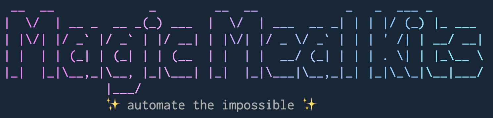

<p align="center">
  
</p>

# MMK Skills

Claude Code skills for automating [Magic Meal Kits](https://magicmealkits.com) CLI operations. Covers Notion, Paymint, Threads, and YouTube — all accessible via `/` commands in Claude Code.

## Getting Started

### 1. Install the MMK CLI

```bash
npm install -g @magic-meal-kits/cli
mmk config set server <your-server-url>
mmk auth login
```

### 2. Install Skills

```bash
# Install all skills at once
npx skills add https://github.com/magic-meal-kits/mmk-skills

# Or pick only what you need
npx skills add https://github.com/magic-meal-kits/mmk-skills/tree/main/mmk-notion
npx skills add https://github.com/magic-meal-kits/mmk-skills/tree/main/mmk-paymint
npx skills add https://github.com/magic-meal-kits/mmk-skills/tree/main/mmk-threads
npx skills add https://github.com/magic-meal-kits/mmk-skills/tree/main/mmk-youtube
```

### 3. Use

Type `/` in Claude Code to see available skills:

```
/mmk-notion     — Notion page, workspace, team, people, database, meeting management
/mmk-paymint    — Payment invoice management
/mmk-threads    — Threads posts, insights, and replies
/mmk-youtube    — YouTube metadata, transcripts, and video type
/recipe-notion-invite-with-fallback — Invite to Notion with Gmail fallback
```

## Skill Inventory

| Skill | Type | Trigger | Commands |
|-------|------|---------|----------|
| `mmk-shared` | Background | Auto-loaded | Foundation: auth, flags, errors |
| `mmk-notion` | Core | `/mmk-notion` | 22 commands across page, workspace, team, people, database, meeting |
| `mmk-paymint` | Core | `/mmk-paymint` | 5 commands: licenses, send, status, cancel, resend |
| `mmk-threads` | Core | `/mmk-threads` | 3 commands: posts, insights, replies |
| `mmk-youtube` | Core | `/mmk-youtube` | 3 commands: metadata, videotype, transcript |
| `recipe-notion-invite-with-fallback` | Recipe | Manual only | Multi-step: Notion invite + Gmail signup fallback |

### Architecture

```
mmk-shared (background)          <- Foundation: auth, flags, errors
├── mmk-notion (core)            <- 22 Notion commands
├── mmk-paymint (core)           <- 5 Paymint commands
├── mmk-threads (core)           <- 3 Threads commands
├── mmk-youtube (core)           <- 3 YouTube commands
└── recipe-notion-invite-with-fallback (recipe)
```

- **Background skills** load automatically when relevant context is detected
- **Core skills** are user-invocable via `/` commands, scoped to `Bash(mmk *)`
- **Recipe skills** require manual invocation (`disable-model-invocation: true`) because they have side effects

## Usage Examples

### Notion: Invite a user to a page

```
/mmk-notion
> Invite kim@example.com as editor to https://notion.so/my-page-abc123
```

### Paymint: Send an invoice

```
/mmk-paymint
> Send a 50,000 KRW invoice to 01012345678 for "Workshop Fee", name "Kim", message "March workshop", expiring 2026-04-01
```

### Threads: Check recent posts with engagement

```
/mmk-threads
> Show my last 10 posts with engagement metrics
```

### YouTube: Get a transcript

```
/mmk-youtube
> Get the transcript for https://youtube.com/watch?v=abc123
```

## Compatibility

These skills work alongside [GWS Skills](https://github.com/pureugong/gws) (Google Workspace CLI). The `recipe-notion-invite-with-fallback` skill composes both `mmk` and `gws` commands.

## Requirements

- [Claude Code](https://docs.anthropic.com/en/docs/claude-code) CLI
- [MMK CLI](https://www.npmjs.com/package/@magic-meal-kits/cli) (`npm install -g @magic-meal-kits/cli`)
- Active MMK server endpoint
